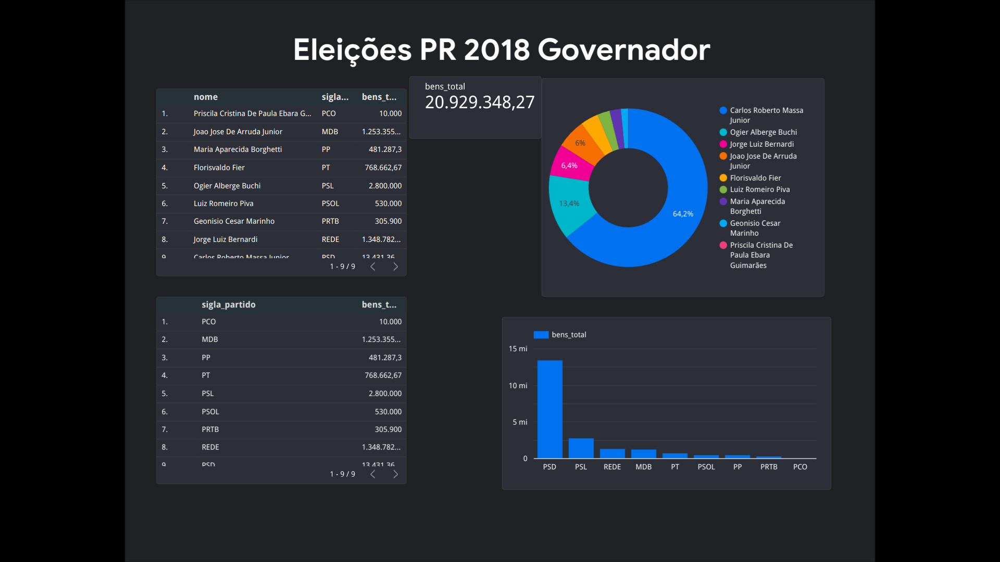

<!DOCTYPE html>
<html>
<head>
	<meta charset="utf-8">
	<meta name="viewport" content="width=device-width, initial-scale=1">
	<title>README</title>
</head>
<body>
	<h1>Data Analysis of Governor Candidates' Assets in PR in 2018</h1>
	
This repository contains a data analysis done in SQL to analyze the assets of governor candidates in Paraná during the 2018 elections and verify if there was any correlation between the declared assets and the election results.

	
The SQL code used was responsible for extracting and consolidating public asset data declared by candidates in the Superior Electoral Court (TSE), as well as the election results. Using a join with the results spreadsheet, I intend to perform a comparative analysis between the declared assets of the candidates and the percentage of votes received.

	
The project's idea at the moment was to quantify the candidates' assets for visualization purposes.

	
To execute the analysis, Google Colab was used. The entire code is available in a Jupyter Notebook, which can be accessed through the link below:

	<ul>
		<li><a href="https://console.cloud.google.com/bigquery?sq=190704890430:c325bca6eb784da2aa619610ace2f8c5">Date in Colab</a></li>
	</ul>
	
The data visualization can be found in the file <em>screen.png</em>.

	
The SQL code used in this project is available in this repository and can be useful for other similar analyses in other elections or political contexts.

	<h2>Technologies Used</h2>
	<ul>
		<li>SQL</li>
		<li>Python</li>
		<li>Jupyter Notebook</li>
		<li>Google Colab</li>
		<li>Google Cloud</li>
		<li>Pandas</li>
		<li>Matplotlib</li>
		<li>Google Looker</li>
	</ul>
	<h2>Authors</h2>
	<ul>
		<li>Daniel Vicente</li>
	</ul>
	<h2>Acknowledgments</h2>
	
Special thanks to the Base Dados repository for the created data.

	
</body>

<!DOCTYPE html>
<html>
<head>
	<meta charset="utf-8">
	<meta name="viewport" content="width=device-width, initial-scale=1">
	<title>README</title>
</head>
<body>
	<h1>Análise de Dados sobre Bens de Candidatos a Governador do PR em 2018</h1>
	
Este repositório contém uma análise de dados feita em  SQL para analisar os bens dos candidatos a governador do Paraná nas eleições de 2018 e verificar se havia alguma correlação entre o patrimônio declarado pelos candidatos e o resultado das eleições.

	
 O código SQL utilizado foi responsável por extrair e consolidar dados públicos de patrimônio declarados pelos candidatos no Tribunal Superior Eleitoral (TSE), bem como os resultados das eleições. Com isso pretendo através do join com a planilha de resultados futuramente realizar uma análise comparativa entre o patrimônio declarado pelos candidatos e o percentual de votos recebidos.
	A ideia do projeto neste momento era quantizar os bens dos candidatos para visualização

	
Para executar a análise, foi utilizado o Google Colab. Todo o código está disponível em um notebook Jupyter, que pode ser acessado através do link abaixo:

	<ul>
		<li><a href="https://console.cloud.google.com/bigquery?sq=190704890430:c325bca6eb784da2aa619610ace2f8c5">Date in Colab</a></li>
	</ul>
	
A visualização dos dados pode ser encontrada no arquivo 
     

	 
O código SQL utilizado neste projeto está disponível neste repositório e pode ser útil para outras análises similares em outras eleições ou contextos políticos.

	<h2>Tecnologias Utilizadas</h2>
	<ul>
		<li>SQL</li>
		<li>Python</li>
		<li>Jupyter Notebook</li>
		<li>Google Colab</li>
		<li>Google Cloud</li>
		<li>Pandas</li>
		<li>Matplotlib</li>
		<li>Google Looker</li>
	</ul>
	<h2>Autores</h2>
	<ul>
		<li>Daniel Vicente</li>
	
	

	Agradecimentos
	Agradeça ao repositório Base dados pelos dados criados.
</body>
</html>

